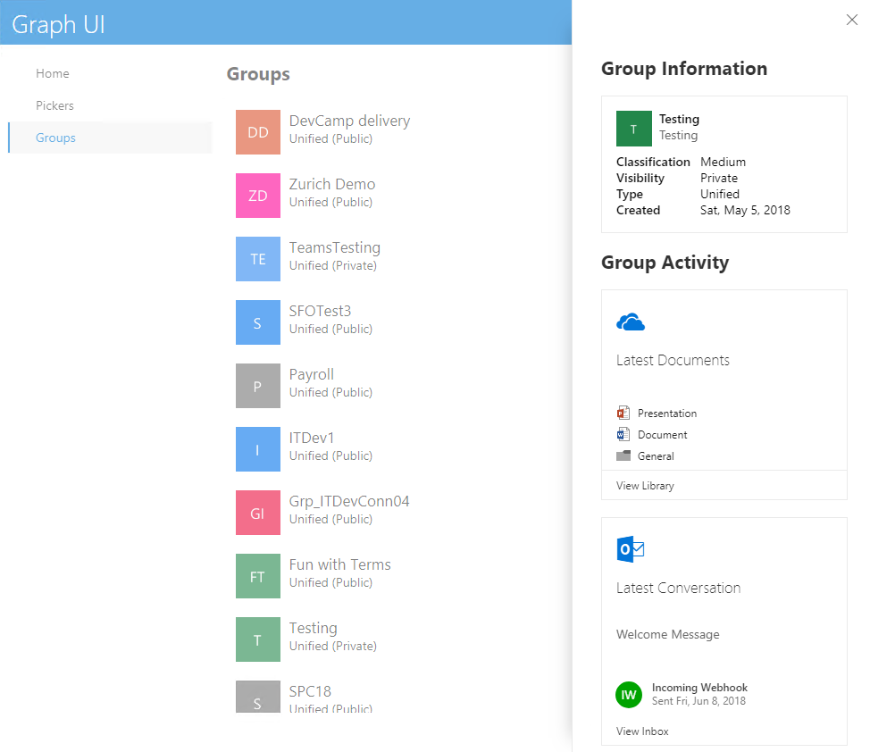

# Demo - Using Adaptive Cards

This demo will use an Adaptive Card to render Group information.

1. Open the file `Controllers\GroupDataController.cs`
1. Locate the `CreateGroupCard` method. It is currently a stub returning an empty card.
1. Replace the contents of the `CreateGroupCard` method with the following. (The full **CreateGroupCard** method is in the file `LabFiles\Cards\Groups\CreateGroupCard.cs`).

  ```csharp
  private AdaptiveCard CreateGroupCard(Models.GroupModel group)
  {
    AdaptiveCard groupCard = new AdaptiveCard()
    {
      Type = "AdaptiveCard",
      Version = "1.0"
    };

    AdaptiveContainer infoContainer = new AdaptiveContainer();
    AdaptiveColumnSet infoColSet = new AdaptiveColumnSet();

    bool noPic = String.IsNullOrEmpty(group.Thumbnail);

    if (!noPic)
    {
      AdaptiveColumn picCol = new AdaptiveColumn() { Width = AdaptiveColumnWidth.Auto };
      picCol.Items.Add(new AdaptiveImage() { Url = new Uri(group.Thumbnail), Size = AdaptiveImageSize.Small, Style = AdaptiveImageStyle.Default });
      infoColSet.Columns.Add(picCol);
    }

    AdaptiveColumn txtCol = new AdaptiveColumn() { Width = AdaptiveColumnWidth.Stretch };
    var titleBlock = new AdaptiveTextBlock() { Text = NullSafeString(group.Name), Weight = AdaptiveTextWeight.Bolder };
    if (noPic) { titleBlock.Size = AdaptiveTextSize.Large; }
    txtCol.Items.Add(titleBlock);

    txtCol.Items.Add(new AdaptiveTextBlock() { Text = NullSafeString(group.Description), Spacing = AdaptiveSpacing.None, IsSubtle = true });
    infoColSet.Columns.Add(txtCol);
    infoContainer.Items.Add(infoColSet);

    groupCard.Body.Add(infoContainer);

    AdaptiveContainer factContainer = new AdaptiveContainer();
    AdaptiveFactSet factSet = new AdaptiveFactSet();

    if (!String.IsNullOrEmpty(group.Classification))
    {
      factSet.Facts.Add(new AdaptiveFact()
      {
        Title = "Classification",
        Value = group.Classification
      });
    }
    if (!String.IsNullOrEmpty(group.Visibility))
    {
      factSet.Facts.Add(new AdaptiveFact()
      {
        Title = "Visibility",
        Value = group.Visibility
      });
    }

    if (!String.IsNullOrEmpty(group.GroupType))
    {
      factSet.Facts.Add(new AdaptiveFact()
      {
        Title = "Type",
        Value = NullSafeString(group.GroupType)
      });
    }

    if (group.CreatedDateTime.HasValue)
    {
      factSet.Facts.Add(new AdaptiveFact()
      {
        Title = "Created",
        Value = $"{{{{DATE({group.CreatedDateTime.Value.UtcDateTime.ToString("yyyy-MM-ddTHH:mm:ssZ")},SHORT)}}}}"
      });

    }

    if (!String.IsNullOrEmpty(group.Policy) && group.RenewedDateTime.HasValue)
    {

      factSet.Facts.Add(new AdaptiveFact()
      {
        Title = "Policy",
        Value = NullSafeString(group.Policy)
      });
      factSet.Facts.Add(new AdaptiveFact()
      {
        Title = "Renewed",
        Value = $"{{{{DATE({group.RenewedDateTime.Value.UtcDateTime.ToString("yyyy-MM-ddTHH:mm:ssZ")},SHORT)}}}}"
      });
    }

    factContainer.Items.Add(factSet);
    groupCard.Body.Add(factContainer);

    return groupCard;
  }
  ```

1. In Solution Explorer, right-click on the **Components** folder and choose **Add > New Item...**
1. Select the **SCSS Style Sheet (SASS)** template. Name file `GroupCard.scss`.
1. Replace the contents of the template with the code from the file `LabFiles\Cards\Groups\GroupCard.scss`.

1. In Solution Explorer, right-click on the **Components** folder and choose **Add > New Item...**
1. Select the **TypeScript JSX File** template. Name file `GroupCard.tsx`.
1. Replace the contents of the template with the following. (The complete code for the `GroupCard` class is in the file `LabFiles\Cards\Groups\GroupCard.tsx`.)

  ```typescript
  import * as React from 'react';
  import * as AdaptiveCards from "adaptivecards";
  import { IGroupDetailsProps } from './GroupDetails';
  import './GroupCard.scss';

  export class GroupCard extends React.Component<IGroupDetailsProps, any> {
    constructor(props: IGroupDetailsProps) {
      super(props);
    }

    render() {
      let card = "";
      if (this.props.group.infoCard) {
        card = this.renderAdaptiveCard(this.props.group.infoCard);
      }
      return <div className="groupCard" dangerouslySetInnerHTML={{
        __html: card
      }} >
      </div>
    }

    private renderAdaptiveCard(card: any) {
      // Create an AdaptiveCard instance
      var adaptiveCard = new AdaptiveCards.AdaptiveCard();

      // Set its hostConfig property unless you want to use the default Host Config
      // Host Config defines the style and behavior of a card
      adaptiveCard.hostConfig = new AdaptiveCards.HostConfig({
        fontFamily: "Segoe UI, Helvetica Neue, sans-serif"
      });

      // Parse the card payload
      adaptiveCard.parse(card);

      // Render the card to an HTML element:
      var renderedCard = adaptiveCard.render();
      return renderedCard.innerHTML;
    }
  }
  ```

1. Open the file `Components\GroupDetails.tsx`
1. At the top of the file, add the following import statement.

  ```typescript
  import { GroupCard } from './GroupCard';
  ```

1. In the `render` method, locate the `return` statement. Modify the return statement to include the **GroupCard**.

  ```typescript
      return (
      <div>
        <h2>Group Information</h2>
        <DocumentCard>
          <GroupCard group={this.props.group} />
        </DocumentCard>
        {activity}
      </div>
    );
  ```

1. Save all files.
1. Press F5 to run the application. Navigate to the Groups page and click on a group. The detail panel will include details about group in addition to the activity.

  
